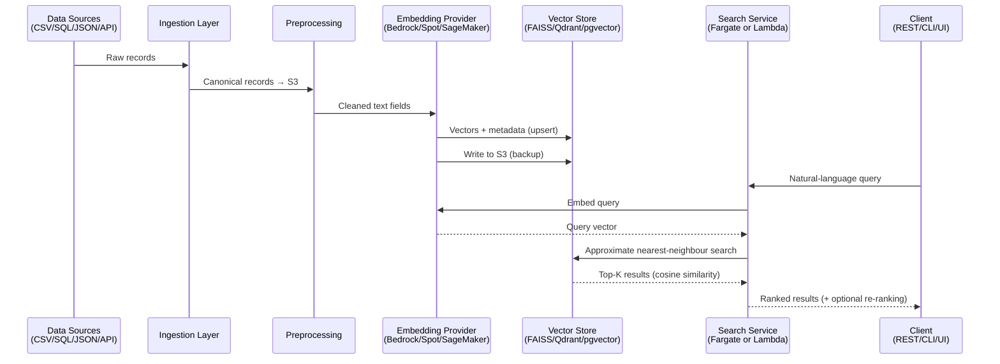

# Semantic Search for Internal Databases

A semantic search system that uses LLM-powered embeddings and vector search to enable natural-language queries across internal structured and semi-structured data sources. Replaces rigid keyword search with meaning-aware retrieval.

## Problem

Organizations store valuable information across databases, CRMs, spreadsheets, and legacy systems but rely on keyword-only search that fails to surface relevant insights. This leads to poor search accuracy, slow manual review, and missed connections across data sources.



## Key Features

- **Natural-language search** across CSV, SQL, JSON, and API data sources
- **Pluggable embedding providers** — AWS Bedrock, Spot-hosted open-source models, SageMaker
- **Multiple vector stores** — FAISS, Qdrant, or pgvector
- **Flexible deployment** — ECS/Fargate or Lambda, toggled via Terraform configuration
- **Filtering & ranking** — cosine similarity with optional cross-encoder re-ranking, support for date/category/tag filters
- **REST API, CLI, and optional UI**

## Architecture Overview

```
Data Sources → Ingestion → Preprocessing → Embedding → Vector Store → Search API → Results
(CSV/SQL/JSON/API)                        (Bedrock/     (FAISS/Qdrant/  (REST/CLI/UI)
                                           Spot/         pgvector)
                                           SageMaker)
```

See `docs/PRD-semantic-search.md` for the product requirements.

## Phase Progress

- **Phase 0 — Planning & Alignment:** Complete. Goals, scope, and architectural direction are captured in the PRD, technical approach, and agent guidelines.
- **Phase 1 — Foundation & Infrastructure:** Complete. Terraform scaffolding, runtime/embedding toggles, and container pipeline documentation are in place, enabling Phase 2 ingestion work.
- **Next:** Implement Phase 2 ingestion connectors and canonical schema pipeline using the documented infrastructure toggles.

## Tech Stack

- **Python** 3.12+
- **AWS Bedrock** / SentenceTransformers / SageMaker (embeddings)
- **FAISS** / **Qdrant** / **pgvector** (vector storage)
- **Terraform** (modular infrastructure-as-code)
- **AWS** ECS/Fargate, Lambda, S3, CloudWatch
- **LangChain** (optional orchestration)

## Prerequisites

- Python >= 3.12.12
- AWS account with appropriate access
- Terraform (for infrastructure provisioning)

## Getting Started

```bash
# Clone the repository
git clone <repo-url>
cd semantic-search

# Install dependencies
pip install -e .

# Run
python main.py
```

## Project Structure

```
.
├── main.py                  # Application entry point
├── pyproject.toml           # Project metadata and dependencies
├── docs/
│   └── PRD-semantic-search.md   # Product requirements document
├── developer/
│   ├── technical_approach.md    # Technical design document
│   ├── project_status.md        # Phase tracking and next actions
│   ├── container_pipeline.md    # Shared build/deploy workflow
│   └── process-flow.md          # End-to-end process diagrams
├── AGENTS.md                # Agent coding guidelines and project context
└── README.md
```

## Key Configuration

Infrastructure is managed through Terraform variables:

- `var.search_runtime` — `"fargate"` or `"lambda"`
- `var.embedding_backend` — selects embedding provider (Bedrock, Spot, SageMaker)
- `var.ingestion_mode` — `"batch"` (default) or `"stream"`

## Documentation

- [Product Requirements](docs/PRD-semantic-search.md)
- [Technical Approach](developer/technical_approach.md)
- [Project Status](developer/project_status.md)
- [Process Flow & Configuration Toggles](developer/process-flow.md)
- [Container Build & Deployment](developer/container_pipeline.md)
- [Agent Guidelines](AGENTS.md)

## License

TBD