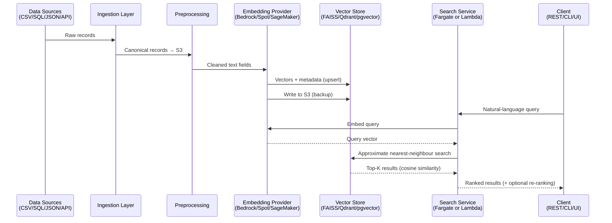

# Semantic Search for Internal Databases

A semantic search system that uses LLM-powered embeddings and vector search to enable natural-language queries across internal structured and semi-structured data sources. Replaces rigid keyword search with meaning-aware retrieval.

## Problem



Organizations store valuable information across databases, CRMs, spreadsheets, and legacy systems but rely on keyword-only search that fails to surface relevant insights. This leads to poor search accuracy, slow manual review, and missed connections across data sources.

## Key Features

- **Natural-language search** across CSV, SQL, JSON, and API data sources
- **Pluggable embedding providers** — AWS Bedrock, Spot-hosted open-source models, SageMaker
- **Multiple vector stores** — FAISS, Qdrant, or pgvector
- **Flexible deployment** — ECS/Fargate or Lambda, toggled via Terraform configuration
- **Filtering & ranking** — cosine similarity with optional cross-encoder re-ranking, support for date/category/tag filters
- **FastAPI runtime & CLI tooling** — container-ready REST service with a shared command-line client for validation and smoke tests
- **Validation UI** — self-contained single-page web interface served at `/ui` for issuing queries during local development and deployment validation

## Architecture Overview

```
Data Sources → Ingestion → Preprocessing → Embedding → Vector Store → Search API → Results
(CSV/SQL/JSON/API)                        (Bedrock/     (FAISS/Qdrant/  (REST/CLI/UI)
                                           Spot/         pgvector)
                                           SageMaker)
```

See `docs/PRD-semantic-search.md` for the product requirements.

## Phase Progress

- **Phase 0 — Planning & Alignment:** Complete. Goals, scope, and architectural direction are captured in the PRD, technical approach, and agent guidelines.
- **Phase 1 — Foundation & Infrastructure:** Complete. Terraform scaffolding, runtime/embedding toggles, and container pipeline documentation are in place, enabling Phase 2 ingestion work.
- **Phase 2 — Data Ingestion Layer:** Complete. Pluggable connectors, canonical schema normalisation, and ingestion observability are in place to supply embedding pipelines.
- **Phase 3 — Embedding & Vector Services:** Complete. Bedrock, Spot, and SageMaker adapters implemented; NumPy vector store with cosine/L2/inner-product metrics, persistence, and idempotent upserts delivered; end-to-end embedding pipeline with two-phase S3 backup and resilient error handling wired; 50 tests passing.
- **Phase 4 — Search Runtime & Interfaces:** Complete. FastAPI REST API, CLI, and lightweight validation UI (`/ui`) delivered; full Terraform modules for Fargate and Lambda runtimes, observability module (dashboards/alarms/log widgets), example tfvars, and deployment runbook in place; 67 tests passing. Environment `terraform apply` and smoke-test validation pending.
- **Phase 5 — Quality & Launch Readiness:** Complete. Relevance evaluation suite (`semantic-search-eval` CLI, 5 IR metrics, 54 new tests); Locust load test harness with acceptance criteria; cost optimisation guide; client deployment playbook and Terraform variable reference; 121 tests passing.
- **Deployment — AWS Fargate (dev):** Complete. 53 resources provisioned via `terraform apply`; container image (~85 MB) built and pushed to ECR via CodeBuild; `GET /healthz → 200`; git tag `runtime-v0.1.0` created. `/readyz → 503` until a FAISS index is uploaded to S3.

## Live Environment (dev)

| Resource | Value |
|---|---|
| ALB endpoint | `http://semantic-search-dev-search-alb-396758317.us-east-1.elb.amazonaws.com` |
| ECR image | `696056865313.dkr.ecr.us-east-1.amazonaws.com/semantic-search:main` |
| ECS cluster | `semantic-search-dev-search-cluster` |
| FAISS index bucket | `s3://semantic-search-dev-faiss-index/vector_store/current/` |

> `/readyz` returns 503 until a FAISS index is uploaded to the bucket above and `VECTOR_STORE_PATH` is set in the task definition.

## Tech Stack

- **Python** 3.12+
- **AWS Bedrock** / SentenceTransformers / SageMaker (embeddings)
- **FAISS** / **Qdrant** / **pgvector** (vector storage)
- **Terraform** (modular infrastructure-as-code)
- **AWS** ECS/Fargate, Lambda, S3, CloudWatch
- **LangChain** (optional orchestration)

## Prerequisites

- Python >= 3.12.12
- AWS account with appropriate access
- Terraform (for infrastructure provisioning)

## Getting Started

```bash
# Clone the repository
git clone <repo-url>
cd semantic-search

# Install dependencies
uv sync

# Run tests
uv run pytest

# Start the server (no vector store required — /readyz returns 503 until an index is loaded)
uv run python main.py

# Start with a saved index and the validation UI at http://localhost:8000/ui
VECTOR_STORE_PATH=./my_index ENABLE_UI=true uv run python main.py
```

## Project Structure

```
.
├── main.py                  # Application entry point
├── pyproject.toml           # Project metadata and dependencies
├── semantic_search/
│   ├── embeddings/          # Provider interface, Bedrock/Spot/SageMaker adapters, factory
│   ├── evaluation/          # Relevance evaluation suite (EvalQuery, metrics, CLI)
│   ├── pipeline/            # EmbeddingPipeline (provider → vector store → S3)
│   ├── runtime/             # FastAPI search service, CLI tooling
│   └── vectorstores/        # NumpyVectorStore (L2, cosine, inner-product)
├── tests/
│   ├── embeddings/          # Unit tests for all embedding providers
│   ├── evaluation/          # Relevance evaluation tests
│   ├── load/                # Locust load test harness
│   ├── pipeline/            # Embedding pipeline tests
│   ├── runtime/             # Search API and CLI tests
│   └── vectorstores/        # Vector store tests
├── docs/
│   ├── PRD-semantic-search.md
│   ├── cost_optimisation.md # Cost sizing and tuning guidance
│   └── process_flows/       # End-to-end process diagrams (01–06)
├── developer/
│   ├── technical_approach.md
│   ├── project_status.md
│   ├── container_pipeline.md
│   ├── developer-journal.md
│   ├── handoff/             # Deployment playbook & Terraform variable reference
│   └── runbooks/            # Operational runbooks (runtime deployment, rollback)
├── infrastructure/          # Terraform modules and dev environment
├── github/                  # ISSUES and PRs tracking docs
├── AGENTS.md                # Agent coding guidelines and project context
└── README.md
```

## Key Configuration

Infrastructure is managed through Terraform variables:

- `var.search_runtime` — `"fargate"` or `"lambda"`
- `var.embedding_backend` — selects embedding provider (Bedrock, Spot, SageMaker)
- `var.ingestion_mode` — `"batch"` (default) or `"stream"`

## Documentation

- [Product Requirements](docs/PRD-semantic-search.md)
- [Technical Approach](developer/technical_approach.md)
- [Project Status](developer/project_status.md)
- [Process Flow & Configuration Toggles](developer/process-flow.md)
- [Container Build & Deployment](developer/container_pipeline.md)
- [Runtime Deployment Runbook](developer/runbooks/runtime_deploy.md)
- [Data Deployment & Testing Guide](developer/guides/data_and_testing_guide.md)
- [Cost Optimisation Guide](docs/cost_optimisation.md)
- [Deployment Playbook](developer/handoff/deployment_playbook.md)
- [Terraform Variable Reference](developer/handoff/terraform_variable_reference.md)
- [Agent Guidelines](AGENTS.md)

## License

TBD