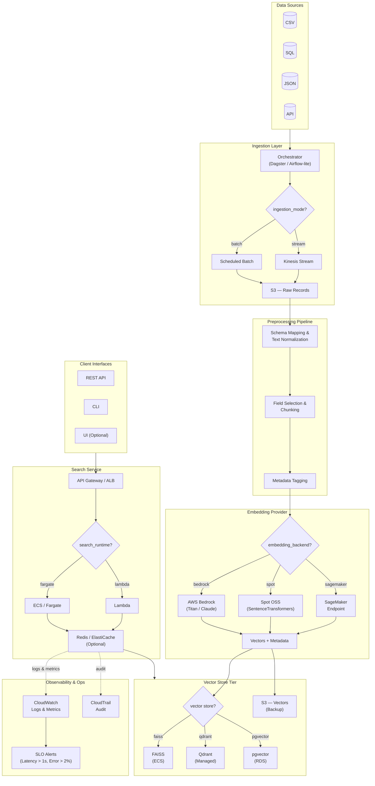

# End-to-End System Flow

```mermaid
flowchart TB
    subgraph Sources["Data Sources"]
        CSV[(CSV)]
        SQL[(SQL)]
        JSON[(JSON)]
        API[(API)]
    end

    subgraph Ingestion["Ingestion Layer"]
        direction TB
        ORCH["Orchestrator<br/>(Dagster / Airflow-lite)"]
        BATCH{"ingestion_mode?"}
        BATCHP["Scheduled Batch"]
        STREAM["Kinesis Stream"]
        S3RAW["S3 — Raw Records"]
    end

    subgraph Preprocessing["Preprocessing Pipeline"]
        NORM["Schema Mapping &<br/>Text Normalization"]
        CHUNK["Field Selection &<br/>Chunking"]
        META["Metadata Tagging"]
    end

    subgraph Embedding["Embedding Provider"]
        ESEL{"embedding_backend?"}
        BEDROCK["AWS Bedrock<br/>(Titan / Claude)"]
        SPOT["Spot OSS<br/>(SentenceTransformers)"]
        SAGE["SageMaker<br/>Endpoint"]
        VECTORS["Vectors + Metadata"]
    end

    subgraph Storage["Vector Store Tier"]
        VSEL{"vector store?"}
        FAISS["FAISS<br/>(ECS)"]
        QDRANT["Qdrant<br/>(Managed)"]
        PGVEC["pgvector<br/>(RDS)"]
        S3VEC["S3 — Vectors<br/>(Backup)"]
    end

    subgraph Search["Search Service"]
        direction TB
        APIGW["API Gateway / ALB"]
        RUNTIME{"search_runtime?"}
        FARGATE["ECS / Fargate"]
        LAMBDA["Lambda"]
        CACHE["Redis / ElastiCache<br/>(Optional)"]
    end

    subgraph Clients["Client Interfaces"]
        REST["REST API"]
        CLI["CLI"]
        UI["UI (Optional)"]
    end

    subgraph Observability["Observability & Ops"]
        CW["CloudWatch<br/>Logs & Metrics"]
        ALERTS["SLO Alerts<br/>(Latency > 1s, Error > 2%)"]
        CT["CloudTrail<br/>Audit"]
    end

    Sources --> ORCH
    ORCH --> BATCH
    BATCH -->|batch| BATCHP
    BATCH -->|stream| STREAM
    BATCHP --> S3RAW
    STREAM --> S3RAW
    S3RAW --> NORM --> CHUNK --> META

    META --> ESEL
    ESEL -->|bedrock| BEDROCK
    ESEL -->|spot| SPOT
    ESEL -->|sagemaker| SAGE
    BEDROCK --> VECTORS
    SPOT --> VECTORS
    SAGE --> VECTORS

    VECTORS --> VSEL
    VSEL -->|faiss| FAISS
    VSEL -->|qdrant| QDRANT
    VSEL -->|pgvector| PGVEC
    VECTORS --> S3VEC

    Clients --> APIGW
    APIGW --> RUNTIME
    RUNTIME -->|fargate| FARGATE
    RUNTIME -->|lambda| LAMBDA
    FARGATE --> CACHE
    LAMBDA --> CACHE
    CACHE --> Storage

    CACHE -.->|logs & metrics| CW
    CW --> ALERTS
    CACHE -.->|audit| CT
```
