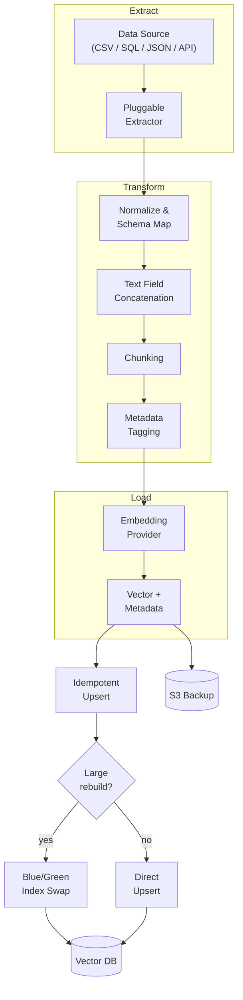

# Data Ingestion & Indexing Pipeline

```mermaid
flowchart TD
    subgraph Extract
        SRC["Data Source<br/>(CSV / SQL / JSON / API)"]
        PLUG["Pluggable<br/>Extractor"]
    end

    subgraph Transform
        NORM["Normalize &<br/>Schema Map"]
        CONCAT["Text Field<br/>Concatenation"]
        CHUNK["Chunking"]
        TAG["Metadata<br/>Tagging"]
    end

    subgraph Load
        EMB["Embedding<br/>Provider"]
        VEC["Vector +<br/>Metadata"]
    end

    SRC --> PLUG --> NORM --> CONCAT --> CHUNK --> TAG
    TAG --> EMB --> VEC
    VEC --> UPSERT["Idempotent<br/>Upsert"]
    UPSERT --> BG{"Large<br/>rebuild?"}
    BG -->|yes| BGSWAP["Blue/Green<br/>Index Swap"] --> VDB[(Vector DB)]
    BG -->|no| DIRECT["Direct<br/>Upsert"] --> VDB
    VEC --> S3[(S3 Backup)]
```
