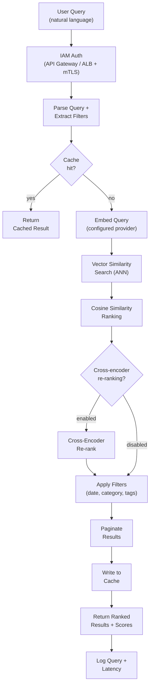

# Search Query Flow

```mermaid
flowchart TD
    USER["User Query<br/>(natural language)"]
    AUTH["IAM Auth<br/>(API Gateway / ALB + mTLS)"]
    PARSE["Parse Query +<br/>Extract Filters"]
    CACHE_CHK{"Cache<br/>hit?"}
    CACHED["Return<br/>Cached Result"]
    EMBED["Embed Query<br/>(configured provider)"]
    VSEARCH["Vector Similarity<br/>Search (ANN)"]
    COSINE["Cosine Similarity<br/>Ranking"]
    RERANK{"Cross-encoder<br/>re-ranking?"}
    CROSS["Cross-Encoder<br/>Re-rank"]
    FILTER["Apply Filters<br/>(date, category, tags)"]
    PAGE["Paginate<br/>Results"]
    CACHE_SET["Write to<br/>Cache"]
    RETURN["Return Ranked<br/>Results + Scores"]
    LOG["Log Query +<br/>Latency"]

    USER --> AUTH --> PARSE --> CACHE_CHK
    CACHE_CHK -->|yes| CACHED
    CACHE_CHK -->|no| EMBED
    EMBED --> VSEARCH --> COSINE --> RERANK
    RERANK -->|enabled| CROSS --> FILTER
    RERANK -->|disabled| FILTER
    FILTER --> PAGE --> CACHE_SET --> RETURN
    RETURN --> LOG
```
