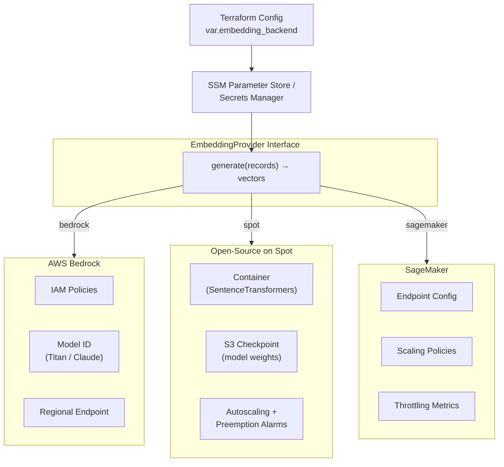

# Embedding Provider Selection

```mermaid
flowchart TD
    CFG["Terraform Config<br/>var.embedding_backend"]
    SSM["SSM Parameter Store /<br/>Secrets Manager"]

    subgraph Interface["EmbeddingProvider Interface"]
        GEN["generate(records) → vectors"]
    end

    subgraph Bedrock["AWS Bedrock"]
        B_IAM["IAM Policies"]
        B_MODEL["Model ID<br/>(Titan / Claude)"]
        B_REGION["Regional Endpoint"]
    end

    subgraph Spot["Open-Source on Spot"]
        S_CONT["Container<br/>(SentenceTransformers)"]
        S_CHKPT["S3 Checkpoint<br/>(model weights)"]
        S_ASG["Autoscaling +<br/>Preemption Alarms"]
    end

    subgraph SageMaker["SageMaker"]
        SM_EP["Endpoint Config"]
        SM_SCALE["Scaling Policies"]
        SM_CW["Throttling Metrics"]
    end

    CFG --> SSM --> GEN
    GEN -->|bedrock| Bedrock
    GEN -->|spot| Spot
    GEN -->|sagemaker| SageMaker
```
