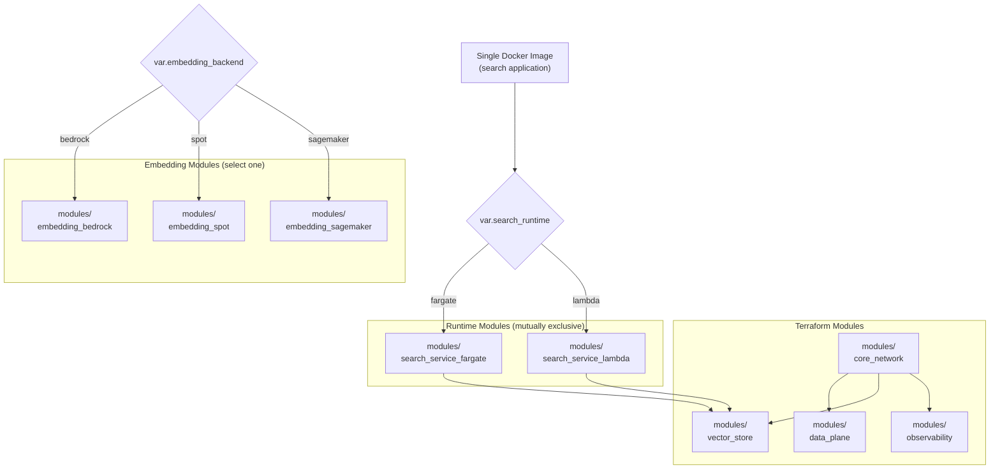

# Infrastructure & Deployment

```mermaid
flowchart TD
    subgraph Terraform["Terraform Modules"]
        TF_NET["modules/<br/>core_network"]
        TF_DATA["modules/<br/>data_plane"]
        TF_VEC["modules/<br/>vector_store"]
        TF_OBS["modules/<br/>observability"]
    end

    subgraph RuntimeMod["Runtime Modules (mutually exclusive)"]
        TF_FG["modules/<br/>search_service_fargate"]
        TF_LM["modules/<br/>search_service_lambda"]
    end

    subgraph EmbedMod["Embedding Modules (select one)"]
        TF_EB["modules/<br/>embedding_bedrock"]
        TF_ES["modules/<br/>embedding_spot"]
        TF_ESM["modules/<br/>embedding_sagemaker"]
    end

    DOCKER["Single Docker Image<br/>(search application)"]

    TOGGLE_R{"var.search_runtime"}
    TOGGLE_E{"var.embedding_backend"}

    TF_NET --> TF_DATA
    TF_NET --> TF_VEC
    TF_NET --> TF_OBS

    DOCKER --> TOGGLE_R
    TOGGLE_R -->|fargate| TF_FG
    TOGGLE_R -->|lambda| TF_LM

    TOGGLE_E -->|bedrock| TF_EB
    TOGGLE_E -->|spot| TF_ES
    TOGGLE_E -->|sagemaker| TF_ESM

    TF_FG --> TF_VEC
    TF_LM --> TF_VEC
```
