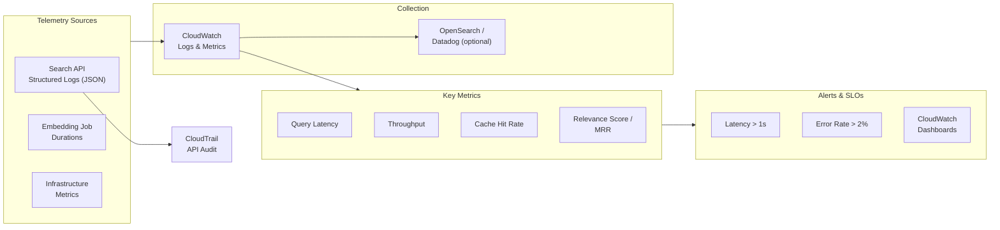

# Observability & Alerting

```mermaid
flowchart LR
    subgraph Sources["Telemetry Sources"]
        API_LOG["Search API<br/>Structured Logs (JSON)"]
        EMB_LOG["Embedding Job<br/>Durations"]
        INFRA["Infrastructure<br/>Metrics"]
    end

    subgraph Collect["Collection"]
        CW["CloudWatch<br/>Logs & Metrics"]
        OPTIONAL["OpenSearch /<br/>Datadog (optional)"]
    end

    subgraph Metrics["Key Metrics"]
        LAT["Query Latency"]
        THRU["Throughput"]
        CACHE["Cache Hit Rate"]
        REL["Relevance Score /<br/>MRR"]
    end

    subgraph Alerting["Alerts & SLOs"]
        SLO_LAT["Latency > 1s"]
        SLO_ERR["Error Rate > 2%"]
        DASH["CloudWatch<br/>Dashboards"]
    end

    CT["CloudTrail<br/>API Audit"]

    Sources --> CW
    CW --> OPTIONAL
    CW --> Metrics
    Metrics --> Alerting
    API_LOG --> CT
```
