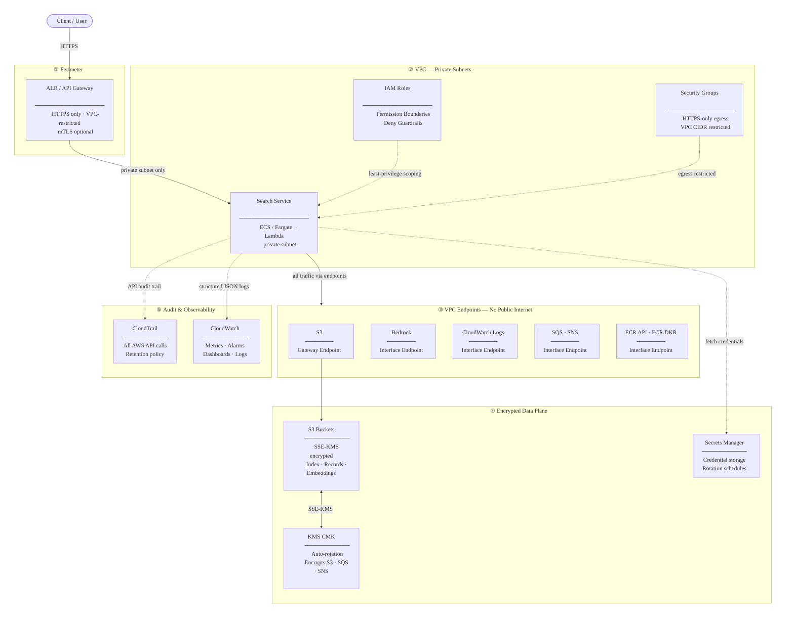

# Security Architecture

High-level overview of the security boundaries, controls, and data flow for the semantic search platform deployed on AWS.

---

---

## Layer Notes

### ① Perimeter
Inbound traffic terminates at the Application Load Balancer (ALB) or API Gateway — the only entry point exposed outside the VPC. All traffic is HTTPS; mutual TLS (`mTLS`) or VPC-based access restrictions can be enabled for production.

### ② VPC — Private Subnets
The search service runs on private subnets with no direct internet access. Each service role carries an IAM permission boundary that caps maximum permissions and inline deny guardrails that block lateral movement, privilege escalation, and bucket destruction even if a container is compromised. Security groups restrict egress to HTTPS-only traffic within the VPC CIDR.

### ③ VPC Endpoints
All AWS service calls (S3, Bedrock, CloudWatch Logs, SQS, SNS, ECR) are routed through VPC interface or gateway endpoints. No control-plane or data-plane traffic leaves AWS networking.

### ④ Encrypted Data Plane
S3 buckets (canonical records, vector index, embeddings) and SQS/SNS queues are encrypted at rest using a customer-managed KMS key with automatic rotation. Credentials are stored in Secrets Manager with rotation schedules and never hardcoded in task definitions or environment variables.

### ⑤ Audit & Observability
CloudTrail captures every AWS API call with retention policies for compliance. CloudWatch provides structured JSON logs, query latency metrics, error-rate alarms (fires at >2%), and dashboards for end-to-end runtime monitoring.
